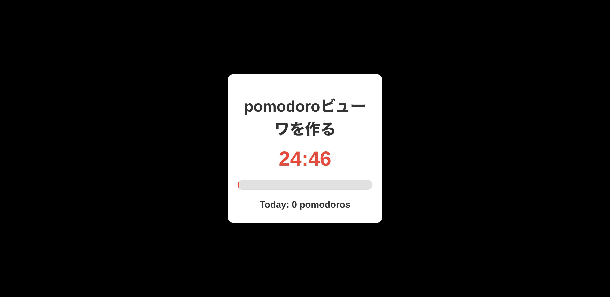
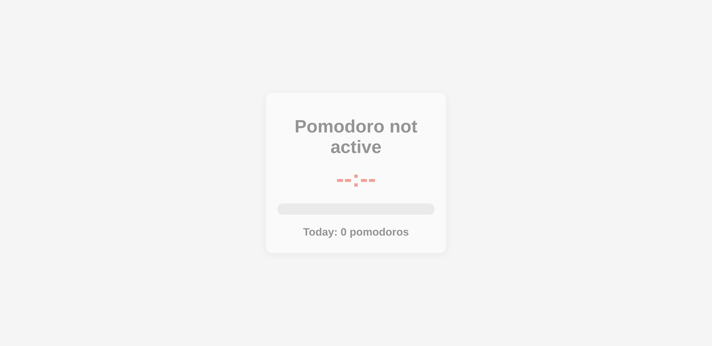

Org-mode Pomodoro Viewer

## 概要

普段Emacsでorg-pomodoroを使ってタスク計測している。LAN内の別の端末から状況を表示できるようにする。

Emacsとの連携は https://kijimad.github.io/.emacs.d/#org19f0828 を参考にする

## メモ

- kindle paper white でも動くように素のJavaScriptである
